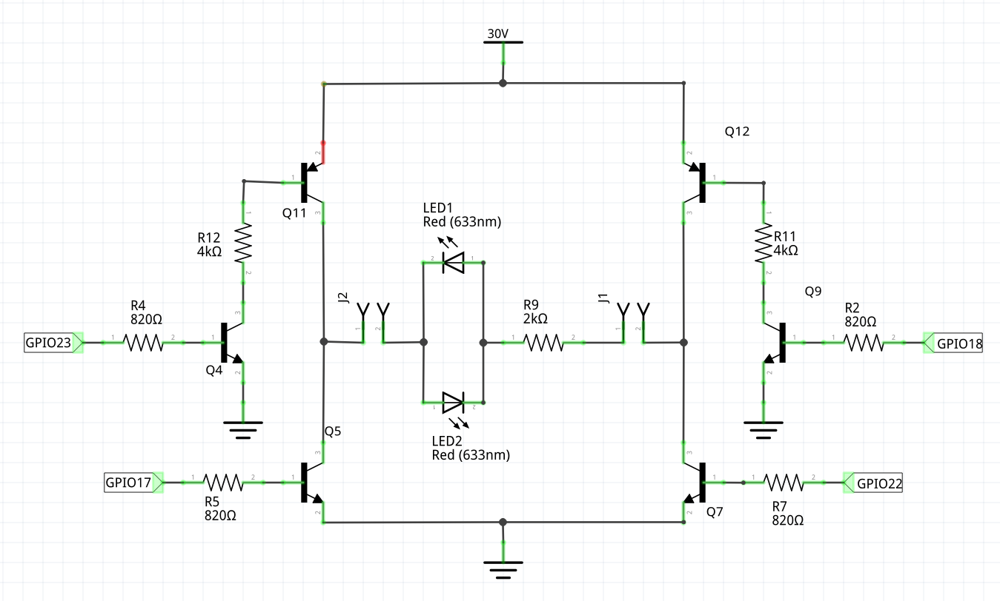

# LED Light Strip Control

Use the raspberry pi to control a LED light strip.

## Schematic

| Schematic | Board |
| --- | --- |
|  |  |

The test LED circuit between the signals LED+ and LED- is be replaced
with LED strip for actual use.

## Implementation Plan

All phases not shown are done.

### Phase 5

Write software to allow Internet control of the board.
